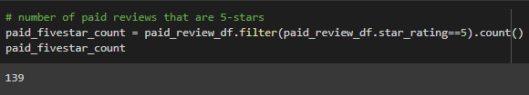

# Amazon_Vine_Analysis

For this module, we used datasets that contained reviews of specific products and used Pyspark to preform the ETL process to extract and transform the data to eventually load the dataset into PgAdmin. After loading the data into pgadmin, we were tasked with filtering the Vine data to determine if having a paid vine subscription makes a difference in the percentage of 5-Star reviews. 

Results:

-The total number of vine reviews for this specific dataset that had a helpful vote percentage of 50% or more was a total of 333 reviews. 

-The total number of non-vine reviews in this data with a helpful vote percentage of 50% or more was 61,474 total reviews

-The total number of reviews all together that had a 50% helpful vote percentage was 61,807.

-The total number of vine reviews that were 5-Stars was 139 reviews.

-The total number of non-vine reviews that were 5- star was 32,646 reviews.

-The percentage of vine reviews that were 5 -star was 41.74 %

-The percentage of non-vine reviews that was 53.1 %.

Summary:

For this specific dataset, you can see there isn’t much bias in the Vine program when it comes to 5-star reviews. We can actually see in this dataset that the total number of non-vine reviews that were 5-star is actually greater than the total number of vine reviews that were 5-star. We see that 53% of non-vine reviews were 5 stare and that 43% of vine reviews were 5-star. In order to investigate further if there is any bias towards the vine review or non-vine, we could use the same process on different datasets to see if there is a trend with different types of products. 

Other analysis that we could preform to see if there is the same trend in this dataset would be to look at a handful of datasets and use the same process we used on this dataset. This way we can compare the datasets to see if it is bias toward different types of proucts. Another way we can look at the dataset is to look at the dataset as a whole and see how the other star reviews compare to vine and nonvine reviews. Instead of just looking at the 5-star reviews we should look at the other rated reviews as well. 
